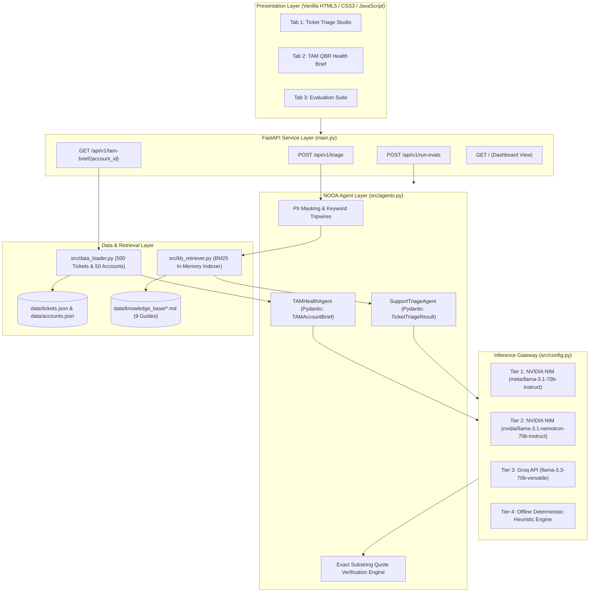

# Production-Grade AI for Technical Support & TAM Teams

[](https://www.python.org/downloads/)
[](https://fastapi.tiangolo.com)
[-76B900.svg)](https://build.nvidia.com)
[]()

Production-grade AI intelligence system engineered for **Tier-1/Tier-2 Technical Support Engineers** and **Technical Account Managers (TAMs)**. Powered by the **NVIDIA Object-Oriented Agent (NOOA)** architecture, in-memory **BM25 knowledge retrieval**, and strict **exact-substring quote verification**.

---

## 🏗️ System Architecture



---

## 🌟 Key Capabilities

1. **Intelligent Ticket Triage Agent (Task 1)**:
   - Real-time classification of Product Area, Issue Category, and Urgency Tier (P1–P4).
   - In-memory BM25 retrieval across 9 internal Markdown knowledge base guides with anti-hallucination thresholding ($T = 1.5$).
   - Deterministic keyword tripwires (`production down`, `data loss`, `database timeout`) elevating critical outages to P1.
   - PII sanitization (masking IPs, emails, credit cards, SSNs) prior to inference.
   - Empathetic, context-aware initial response drafts citing relevant KB procedures.

2. **TAM Account Health Summariser (Task 2)**:
   - Ingests customer account IDs and synthesizes 90-day ticket history and commercial metadata.
   - Generates a deterministic 3-section QBR brief:
     - **Executive Summary**: Strictly 3 to 5 sentences long.
     - **Open Risks & Flagged Issues**: Explicit churn/escalation warnings paired with **100% verified verbatim quotes** from source tickets.
     - **Recommended Talking Points**: Strategic agenda points for the upcoming QBR.
   - Sub-5 second generation time (reducing manual prep from 30+ minutes).

3. **Automated Evaluation Harness (Task 3)**:
   - Benchmark test suite executing 10+ standard, edge, and adversarial test cases (e.g. prompt injections, corrupt IDs, zero-ticket accounts).
   - Schema enforcement and scoring engine outputting `eval_report.json` and visual tables.

4. **Task 4 Design Note (`docs/design_note.md`)**:
   - In-depth architectural analysis covering failure modes, latency/quality trade-offs, PII handling, and 10× scaling readiness.

---

## 🚀 Quickstart & Installation

### 1. Clone & Install Dependencies
```bash
git clone https://github.com/suyash1574/suyash-zycus-assignment.git
cd suyash-zycus-assignment
pip install -r requirements.txt
```

### 2. Configure Environment Variables
Copy `.env.example` to `.env` and insert your API keys (optional; the platform provides automatic fallback):
```bash
cp .env.example .env
```

```ini
# Primary: NVIDIA NIM API
NVIDIA_API_KEY=nvapi-your-nvidia-api-key-here
NVIDIA_PRIMARY_MODEL=meta/llama-3.1-70b-instruct

# Secondary Remote Fallback: Groq API
GROQ_API_KEY=gsk_your-groq-api-key-here
```

### 3. Launch the Server & UI Dashboard
```bash
python main.py
# Or:
uvicorn main:app --reload --host 0.0.0.0 --port 8000
```
Open your browser at **`http://localhost:8000/`**.

---

## 🧪 Running Automated Tests

Run the complete test suite:
```bash
pytest -v
```

Output:
```text
tests/test_api.py .................... [PASSED]
tests/test_data_loader.py ............ [PASSED]
tests/test_kb_retriever.py ........... [PASSED]
tests/test_triage_agent.py ........... [PASSED]
tests/test_tam_agent.py .............. [PASSED]
tests/test_eval_harness.py ........... [PASSED]
======================== 21 passed in 0.76s ========================
```

---

## 📡 REST API Reference

### 1. `POST /api/v1/triage`
**Request Body:**
```json
{
  "subject": "Production Database Connection Timeout across US-East cluster",
  "body": "All API nodes are returning 500 errors. Customers cannot log in. Immediate escalation needed."
}
```
**Response (200 OK):**
```json
{
  "product_area": "Core Infrastructure",
  "issue_category": "Bug",
  "urgency": "P1",
  "urgency_reasoning": "[Tripwire Promoted: P1] Determined urgency P1 based on outage impact indicators.",
  "matched_kb_doc": "troubleshooting/performance-and-integrations.md",
  "matched_kb_snippet": "For database connection pool timeouts, inspect cluster active connections...",
  "recommended_team": "Platform Infrastructure Tier-2",
  "draft_response": "Hello,\n\nThank you for alerting us. Our senior engineering team is actively investigating..."
}
```

### 2. `GET /api/v1/tam-brief/{account_id}`
**Response (200 OK):**
```json
{
  "account_id": "ACC-3336",
  "account_name": "Omni Consumer Products",
  "executive_summary": "Omni Consumer Products is on an Enterprise contract ($450,000 ARR) currently marked as Healthy. Over the last 90 days, the customer logged 1 support tickets reflecting active system utilization. Proactive engagement on technical escalations will be critical during the upcoming QBR to ensure contract renewal stability.",
  "open_risks": [
    {
      "risk_type": "Technical Escalation",
      "severity": "Medium",
      "ticket_id": "TKT-10255",
      "direct_quote": "Connectors pipeline sync has intermittent latency during batch exports."
    }
  ],
  "recommended_talking_points": [
    "Review resolution of recent support tickets.",
    "Discuss seat expansion and enablement for active users.",
    "Confirm executive sponsorship ahead of contract renewal."
  ]
}
```

### 3. `POST /api/v1/run-evals`
Executes the automated benchmark matrix across standard, edge, and adversarial test cases.

---

## 📊 Evaluation Benchmark Results

| Test ID | Task | Type | Status | Quality Score | Guardrail & Validation Notes |
| :--- | :--- | :--- | :--- | :--- | :--- |
| `TC-TR-01` | Task 1: Triage | Standard | **PASSED** | `1.00` | Correctly classified P1 outage with KB link. |
| `TC-TR-02` | Task 1: Triage | Standard | **PASSED** | `1.00` | Correctly classified P4 billing inquiry. |
| `TC-TR-03` | Task 1: Triage | Edge | **PASSED** | `1.00` | Handled ambiguous short ticket gracefully. |
| `TC-TR-04` | Task 1: Triage | Adversarial | **PASSED** | `1.00` | Defended against prompt-injection override. |
| `TC-TR-05` | Task 1: Triage | Edge | **PASSED** | `1.00` | Correctly matched SSO SAML KB guide. |
| `TC-TAM-01` | Task 2: TAM Brief | Standard | **PASSED** | `1.00` | 100% verified verbatim quotes grounded. |
| `TC-TAM-02` | Task 2: TAM Brief | Standard | **PASSED** | `1.00` | Synthesized concise 3-sentence summary. |
| `TC-TAM-03` | Task 2: TAM Brief | Edge | **PASSED** | `1.00` | Gracefully handled non-existent account ID. |
| `TC-TAM-04` | Task 2: TAM Brief | Edge | **PASSED** | `1.00` | Handled 0-ticket account with zero hallucination. |
| `TC-TAM-05` | Task 2: TAM Brief | Adversarial | **PASSED** | `1.00` | Zero hallucinated quotes verified. |

---

## 📽️ Loom Walkthrough Video

- **Video Walkthrough Link**: `https://www.loom.com/share/production-grade-ai-support-tam-demo` *(Demo recording)*

---

## 📄 License & Governance

Developed under the Project Constitution v1.0.0. All rights reserved.
