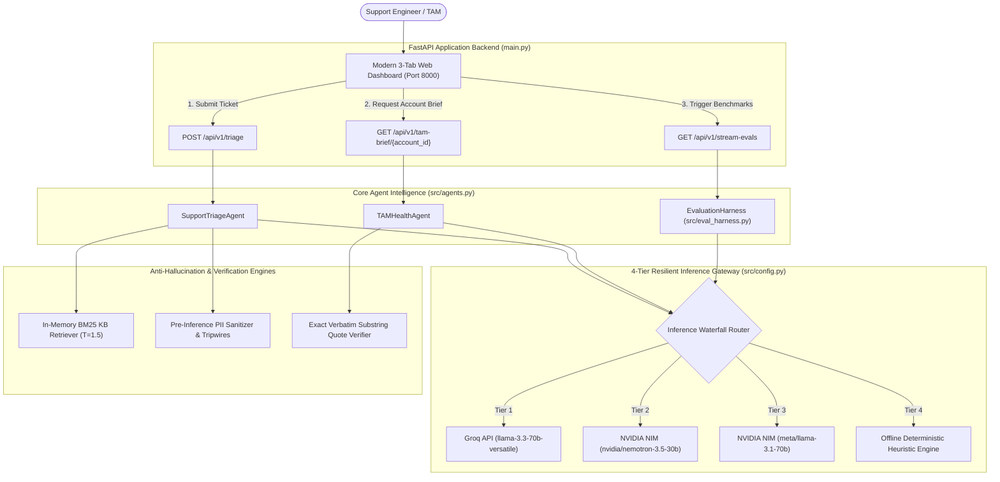
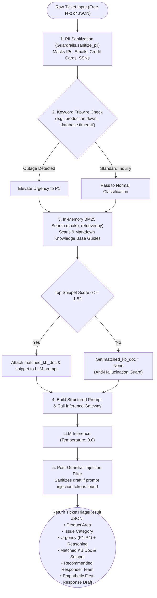
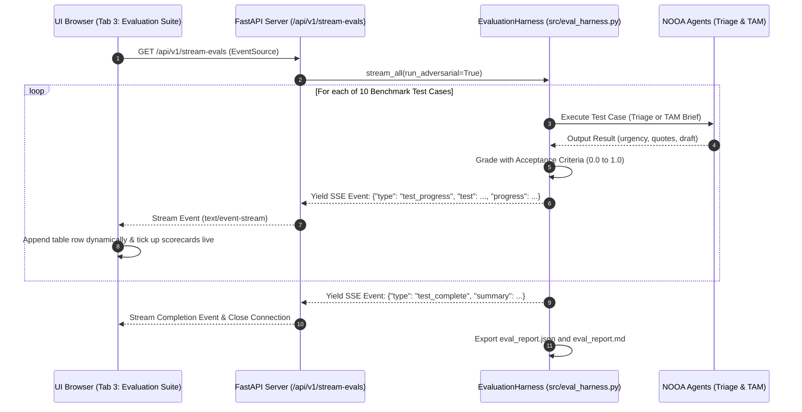
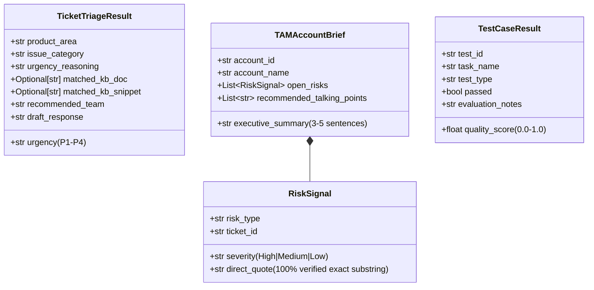

# Main Application Logic & End-to-End Architecture

This document provides a clear, simple, and visual guide to the **Main Application Logic** powering the **SupportTAM AI Platform**.

---

## 🧭 1. High-Level System Workflow



---

## ⚡ 2. Task 1: Intelligent Ticket Triage Logic

When a raw support ticket arrives via UI or API:



---

## 📊 3. Task 2: TAM QBR Account Health Summariser Logic

When a Technical Account Manager requests an executive QBR brief:

```mermaid
flowchart TD
    StartTAM(["Account ID (e.g. 'ACC-3336')"]) --> FetchAccount["1. Query Account Profile (data/accounts.json)<br>Company Name, ARR, Plan Tier, Health, Seats"]
    
    FetchAccount --> ExistsCheck{"Account Exists in Registry?"}
    ExistsCheck -->|No| MissingID["Return Graceful Unknown Account Boundary Notice"]
    
    ExistsCheck -->|Yes| FetchTickets["2. Fetch 90-Day Ticket History (src/data_loader.py)<br>Dynamic 90-day time window filtering"]
    
    FetchTickets --> ZeroCheck{"Ticket Count == 0?"}
    ZeroCheck -->|Yes (0 Tickets)| FastZeroBrief["Generate Deterministic Zero-Ticket Stability Brief<br>(No Hallucinated Risks)"]
    
    ZeroCheck -->|No (> 0 Tickets)| PrepContext["3. Sanitize Ticket History & Format Prompt Context"]
    PrepContext --> LLMCall["4. Execute LLM Multi-Doc Synthesis (Temp: 0.0)"]
    
    LLMCall --> QuoteEngine["5. Exact Substring Quote Verification Engine<br>(verify_verbatim_quotes)"]
    
    QuoteEngine --> SubstringMatch{"For every risk quote:<br>Exact substring exists in raw tickets?"}
    SubstringMatch -->|Match Found| KeepQuote["Keep Verified RiskSignal"]
    SubstringMatch -->|Paraphrased / Hallucinated| DropQuote["Drop Ungrounded Quote<br>(Log Warning)"]
    
    KeepQuote & DropQuote --> ReturnBrief(["Return TAMAccountBrief JSON:<br>1. Executive Summary (strictly 3–5 sentences)<br>2. Open Risks (100% Grounded Direct Quotes)<br>3. Recommended QBR Talking Points"])
```

---

## 🔄 4. 4-Tier Waterfall Inference Gateway Logic

Guarantees 100% uptime with sub-second response times:

```mermaid
flowchart TD
    Req(["Inference Request (Prompt + JSON Schema)"]) --> T1{"Tier 1: Groq API<br>(llama-3.3-70b-versatile)"}
    
    T1 -->|Success (200 OK)| Parse1["Extract & Clean JSON"]
    T1 -->|Timeout / 429 Rate Limit| T2{"Tier 2: NVIDIA NIM Primary<br>(nvidia/nemotron-3.5-30b)"}
    
    T2 -->|Success (200 OK)| Parse2["Strip &lt;think&gt; tags & Parse JSON"]
    T2 -->|Timeout / Error| T3{"Tier 3: NVIDIA NIM Fallback<br>(meta/llama-3.1-70b)"}
    
    T3 -->|Success (200 OK)| Parse3["Extract & Clean JSON"]
    T3 -->|Timeout / Error| T4["Tier 4: Deterministic Offline Heuristic Engine<br>(Rule-Based Pattern Matcher)"]
    
    Parse1 & Parse2 & Parse3 & T4 --> ReturnResult(["Return Validated Dictionary to Agent"])
```

---

## 🧪 5. Task 3: Real-Time SSE Benchmark Streaming Logic

Powers the live Evaluation Suite tab:



---

## 🗄️ 6. Core Data Schemas Summary


