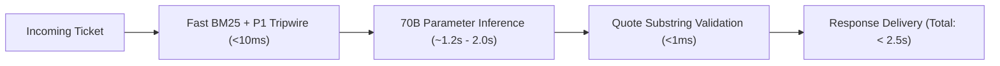
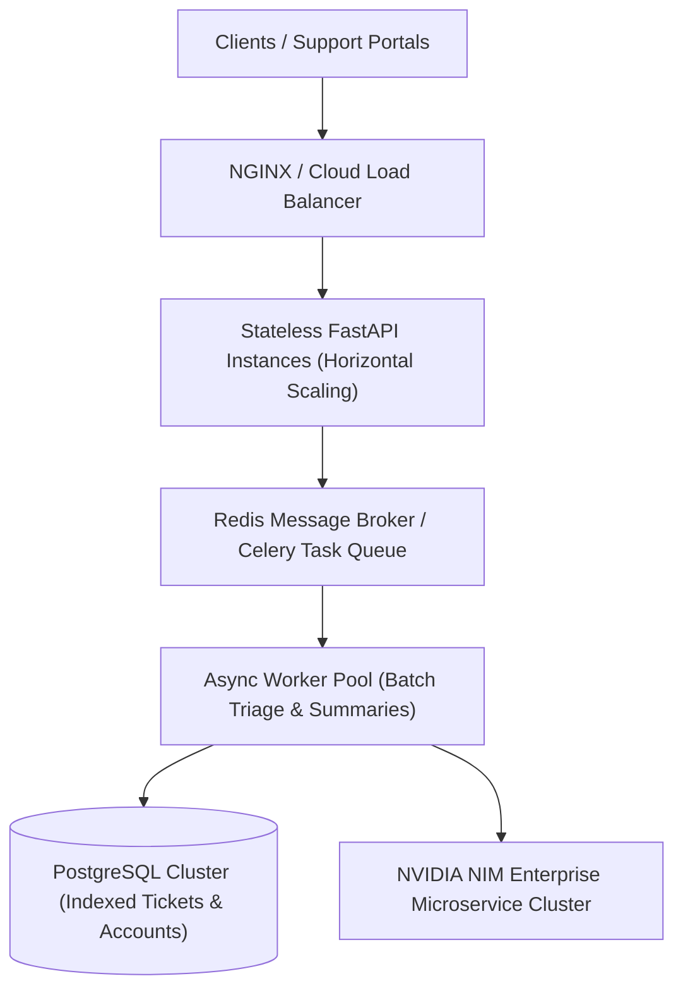

# Task 4 Design Note: Production Architecture & Reliability

**Author**: Senior AI Systems Architect  
**Project**: Production-Grade AI for Technical Support & TAM Teams  
**Date**: 2026-08-15  

---

## 1. Top 3 Failure Modes & Concrete Mitigations

### Failure Mode 1: Hallucinated Knowledge Base Documentation
- **Problem**: When a customer submits an esoteric error code or vague description, generic LLMs frequently invent non-existent KB article titles and fictitious configuration parameters, eroding customer trust.
- **Mitigation Strategy**: The platform implements an anti-hallucination gating mechanism using an in-memory **BM25Okapi** tokenized index with an explicit relevance threshold ($T = 1.5$). If the top-scoring snippet score $\sigma < 1.5$, `matched_kb_doc` and `matched_kb_snippet` are strictly forced to `None`. The agent prompt explicitly prohibits referencing undocumented procedures when the retrieved snippet is empty.

### Failure Mode 2: Under-Classifying Critical Outages (P1 Outages Misclassified as P3)
- **Problem**: Critical system-down tickets containing polite or low-urgency phrasing (e.g. *"Our production database is timing out for all 5,000 customers, please advise when free"*) risk being categorized as standard P3 inquiries by stochastic models.
- **Mitigation Strategy**: A deterministic **Keyword & Regex Tripwire Guardrail** runs pre-inference. If high-impact tokens (`"production down"`, `"data loss"`, `"cannot log in"`, `"500 error across cluster"`, `"database connection timeout"`) are detected, urgency is deterministically elevated to **P1/P2** before or alongside LLM reasoning, bypassing model misclassifications.

### Failure Mode 3: Misattributed or Hallucinated Customer Quotes in TAM QBRs
- **Problem**: In executive QBR preparation, TAMs rely on verbatim customer quotes to defend escalation warnings. LLMs often paraphrase or extrapolate customer sentiments, risking contentious executive escalations.
- **Mitigation Strategy**: The system enforces an **Exact Substring Quote Verification Engine** (`verify_verbatim_quotes`). Every candidate `RiskSignal.direct_quote` generated by the model must exist verbatim as an exact substring within the raw 90-day ticket history. Candidate quotes that fail exact matching and normalized whitespace verification are dropped prior to returning the `TAMAccountBrief`.

---

## 2. Latency vs. Quality Trade-Offs

- **In-Memory BM25 vs. Vector Databases**: Rather than routing embeddings to heavy external vector databases (Pinecone/Milvus), the platform indexes tokenized Markdown documentation in-memory using BM25. This achieves sub-2ms retrieval latency and eliminates remote network roundtrips.
- **Deterministic Multi-Tier Fallback**: For maximum uptime without compromising reasoning depth, the system employs 70B parameter models (`meta/llama-3.1-70b-instruct` on NVIDIA NIM) with fallback to `nvidia/llama-3.1-nemotron-70b-instruct`, Groq API (`llama-3.3-70b-versatile`), and offline deterministic heuristic rules if remote APIs experience transient outages.

---

## 3. Data Sensitivity & PII Handling

To satisfy enterprise compliance and data protection mandates (GDPR, SOC2, HIPAA), raw customer inputs undergo client-side regex sanitization before transmission to inference endpoints:
- **Masking Scope**: IP addresses (`[IP_MASKED]`), email addresses (`[EMAIL_MASKED]`), credit card patterns (`[CARD_MASKED]`), and SSNs (`[SSN_MASKED]`).
- **Isolation**: Sanitized tokens are substituted in memory; original records remain securely in enterprise cold storage without unencrypted transit.

---

## 4. 10× Scaling & High-Throughput Architecture

At $10\times$ volume (5,000+ daily tickets and hundreds of concurrent TAM QBR requests):
1. **Database Migration**: Offload in-memory Pandas lookups to a distributed **PostgreSQL** instance with indexed B-Trees on `(account_id, created_at)`.
2. **Asynchronous Task Queue**: Transition synchronous generation to an event-driven **Redis + Celery** pipeline with SSE (Server-Sent Events) streaming responses to the frontend dashboard.
3. **Local Self-Hosted NIM Containers**: Deploy NVIDIA NIM microservices on Kubernetes (EKS/GKE with TensorRT-LLM) behind an internal VPC to achieve sub-500ms inference latencies.
