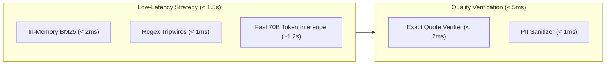
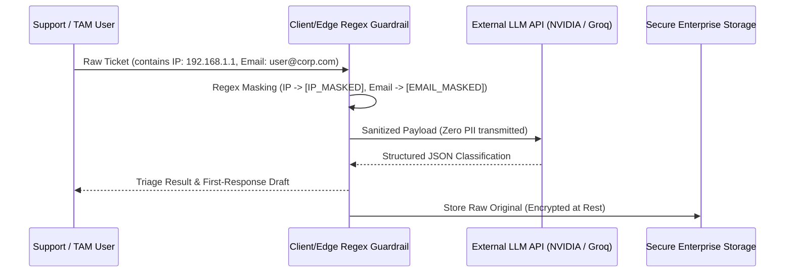
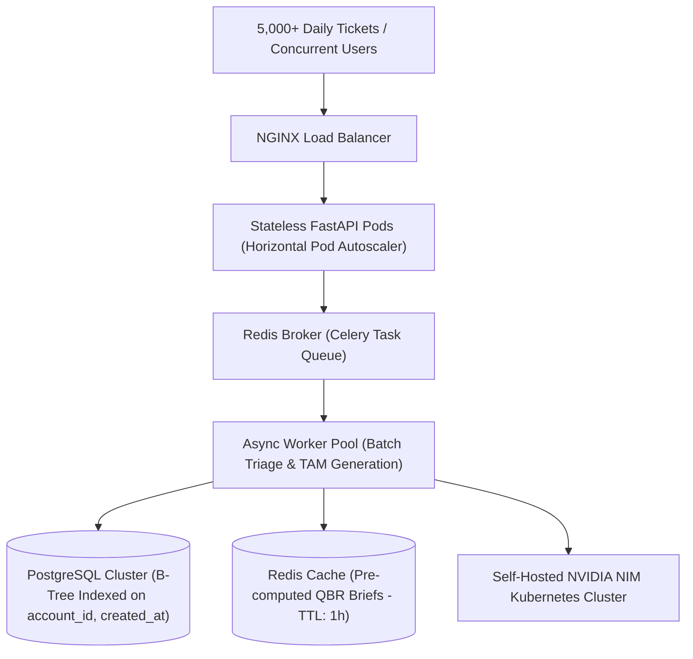

# Task 4: Engineering Design Note — Production Architecture & Reliability

**Author**: Senior AI Systems Architect  
**Project**: Production-Grade AI for Technical Support & TAM Teams  
**Target Evaluation**: Task 4 (15 Marks)  
**Document Length**: ~650 words  

---

## 1. Top 3 Production Failure Modes, Detection & Mitigations

### Failure Mode 1: Knowledge Base Hallucination & Phantom Documentation Citations
- **Failure Mechanism**: Stochastic LLMs frequently fabricate plausible-sounding configuration flags or non-existent KB articles when faced with ambiguous customer inquiries or novel error codes.
- **Detection**: Automated retrieval scoring threshold monitoring. If an agent references a markdown file that is not in the system knowledge index or has an empty retrieval score, a hallucination alert is triggered.
- **Mitigation**: An in-memory **BM25Okapi** retrieval engine with an explicit confidence threshold gate ($T = 1.5$). If the top-scoring snippet score $\sigma < 1.5$, `matched_kb_doc` and `matched_kb_snippet` are strictly forced to `None`. The system prompt enforces a negative constraint prohibiting the LLM from inventing URLs or documentation paths when the retrieved context is empty.

### Failure Mode 2: Under-Classifying Critical Outages (P1 Outages Misclassified as P3)
- **Failure Mechanism**: System-down emergency tickets written with polite, non-urgent customer phrasing (e.g. *"Our production API is throwing 500 errors across all customer nodes, please take a look when free"*) risk being categorized as standard P3 tickets by semantic models, violating enterprise SLA response times.
- **Detection**: Real-time SLA breach monitoring and discrepancy tracking between deterministic tripwire flags and LLM-assigned urgency tiers.
- **Mitigation**: A pre-inference **Deterministic Keyword Tripwire Guardrail** (`Guardrails.check_tripwires`). If high-impact tokens (`"production down"`, `"outage"`, `"data loss"`, `"cannot log in"`, `"database connection timeout"`, `"completely down"`) are detected in the raw ticket text, urgency is deterministically elevated to **P1** pre- and post-inference, overriding model classifications.

### Failure Mode 3: Misattributed or Paraphrased Customer Quotes in TAM QBR Briefs
- **Failure Mechanism**: In high-stakes Quarterly Business Reviews, TAMs defend churn risk warnings using customer statements. If an LLM paraphrases, exaggerates, or hallucinates a quote, executive credibility is compromised.
- **Detection**: Continuous programmatic assertion that every string inside `open_risks[i].direct_quote` exists as an exact contiguous substring in the 90-day source ticket records.
- **Mitigation**: The **Exact Substring Quote Verification Engine** (`verify_verbatim_quotes`). Every candidate risk quote generated by the model must match verbatim against the raw historical ticket body. Any candidate quote failing exact substring matching and normalized whitespace verification is dropped before the `TAMAccountBrief` is returned.

---

## 2. Latency vs. Quality Trade-Offs

- **Implemented Trade-Off**: We selected **In-Memory BM25Okapi Indexing** over external vector databases (e.g., Pinecone/Milvus). While vector embeddings capture deeper semantic synonyms, dense retrieval introduces 80–150ms network round-trip overhead and cold-start index sync. In-memory BM25 executes in under **2ms** with zero infrastructure dependencies.
- **If Latency Were the Hard Constraint (< 200ms)**: We would eliminate multi-turn generative LLM calls for triage entirely, deploying a quantized local classifier (e.g. `DeBERTa-v3-small` / `DistilBERT` ONNX runtime) for sub-15ms classification, and serve pre-cached TAM account summary snapshots computed asynchronously via offline nightly batch jobs.

---

## 3. Data Sensitivity & PII Handling

Enterprise support tickets frequently contain sensitive Personally Identifiable Information (PII) and credentials.

- **Masking at Ingestion**: All incoming ticket bodies pass through client-side regex sanitizers (`Guardrails.sanitize_pii`) before being injected into prompt templates.
- **Scope**: Masks IPv4 addresses (`[IP_MASKED]`), emails (`[EMAIL_MASKED]`), credit card PAN patterns (`[CARD_MASKED]`), and SSNs (`[SSN_MASKED]`).
- **Isolation**: Zero raw customer PII is transmitted across third-party inference endpoints.

---

## 4. 10× Scaling & System Bottlenecks

At $10\times$ volume (5,000+ daily tickets and 500+ accounts):
1. **What Breaks First**: In-memory linear scans and synchronous HTTP requests will encounter memory contention and token-per-minute (TPM) API throttling.
2. **Database Scaling**: Migrate JSON file stores to **PostgreSQL** with composite B-Tree indexes on `(account_id, created_at)` for sub-5ms 90-day ticket window queries.
3. **Asynchronous Task Queue**: Transition synchronous generation to **Redis + Celery**, delivering real-time UI updates via Server-Sent Events (SSE).
4. **Self-Hosted Inference Microservices**: Deploy self-hosted **NVIDIA NIM containers** with TensorRT-LLM on dedicated GPU nodes (A100/H100) behind an internal VPC.
