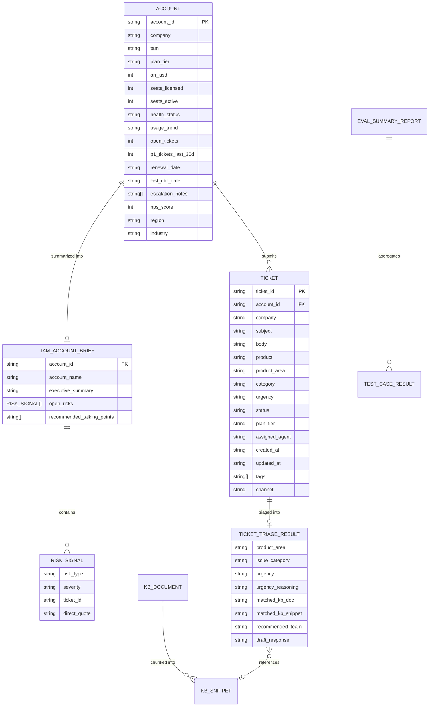

# Data Model Specification: Production-Grade AI for Support & TAM

**Feature**: `001-support-tam-ai`  
**Date**: 2026-08-15  
**Status**: Approved  

---

## 1. Entity Relationship Overview



---

## 2. Core Entities & Schema Definitions

### 2.1 Ticket Schema (`data/tickets.json` & Data Models)
```python
from pydantic import BaseModel, Field
from typing import Optional, List, Literal

class TicketRecord(BaseModel):
    ticket_id: str
    account_id: str
    company: str
    subject: str
    body: str
    product: str
    product_area: str
    category: Literal[
        "Bug", "Feature Request", "How-To", "Performance", 
        "Billing", "Integration", "Onboarding", "Data Loss"
    ]
    urgency: Literal["P1", "P2", "P3", "P4"]
    status: Literal["Open", "In Progress", "Pending Customer", "Resolved", "Closed"]
    plan_tier: Literal["Starter", "Professional", "Business", "Enterprise"]
    assigned_agent: Optional[str] = None
    created_at: str
    updated_at: str
    tags: List[str] = Field(default_factory=list)
    channel: Literal["email", "portal", "chat", "phone"]
    satisfaction_score: Optional[int] = None
```

### 2.2 Account Schema (`data/accounts.json`)
```python
class PrimaryContact(BaseModel):
    name: str
    title: str

class AccountRecord(BaseModel):
    account_id: str
    company: str
    tam: str
    plan_tier: Literal["Starter", "Professional", "Business", "Enterprise"]
    arr_usd: int
    seats_licensed: int
    seats_active: int
    products: List[str]
    health_status: Literal["Healthy", "At Risk", "Churning", "New"]
    usage_trend: Literal["Increasing", "Stable", "Declining", "Inactive"]
    open_tickets: int
    p1_tickets_last_30d: int
    customer_since: Optional[str] = None
    renewal_date: str
    last_qbr_date: str
    primary_contact: Optional[PrimaryContact] = None
    escalation_notes: List[str] = Field(default_factory=list)
    nps_score: Optional[int] = None
    last_login_days_ago: Optional[int] = None
    integrations_active: List[str] = Field(default_factory=list)
    region: str
    industry: str
```

### 2.3 Task 1 Output: `TicketTriageResult`
```python
class TicketTriageRequest(BaseModel):
    subject: str = Field(..., min_length=3, description="Ticket subject line")
    body: str = Field(..., min_length=5, description="Full ticket body description")

class TicketTriageResult(BaseModel):
    product_area: str = Field(..., description="E.g., Authentication, Billing, API, Core Infrastructure")
    issue_category: str = Field(..., description="E.g., Bug, Integration Failure, Account Provisioning, Configuration")
    urgency: Literal["P1", "P2", "P3", "P4"] = Field(..., description="P1: Critical/Down, P2: High, P3: Medium, P4: Low")
    urgency_reasoning: str = Field(..., description="Technical justification for assigned urgency")
    matched_kb_doc: Optional[str] = Field(None, description="Matched knowledge base document filename/title")
    matched_kb_snippet: Optional[str] = Field(None, description="Verbatim relevant section from the matched KB document")
    recommended_team: str = Field(..., description="Target engineering/operations responder team")
    draft_response: str = Field(..., description="Empathetic, structured initial customer reply")
```

### 2.4 Task 2 Output: `TAMAccountBrief` & `RiskSignal`
```python
class RiskSignal(BaseModel):
    risk_type: Literal["Churn Risk", "Technical Escalation", "SLA Breach", "Stakeholder Frustration"]
    severity: Literal["High", "Medium", "Low"]
    ticket_id: str
    direct_quote: str = Field(..., description="Must exist verbatim as a substring in the raw ticket body")

class TAMAccountBrief(BaseModel):
    account_id: str
    account_name: str
    executive_summary: str = Field(..., description="Strictly 3 to 5 sentences covering health, trends, and status")
    open_risks: List[RiskSignal] = Field(default_factory=list, description="Verified grounded risk indicators")
    recommended_talking_points: List[str] = Field(..., min_items=1, description="Strategic agenda points for QBR")
```

### 2.5 Task 3 Output: `EvalSummaryReport` & `TestCaseResult`
```python
class TestCaseResult(BaseModel):
    test_id: str
    task_name: Literal["Task 1: Triage", "Task 2: TAM Brief"]
    test_type: Literal["Standard", "Edge", "Adversarial"]
    passed: bool
    quality_score: float = Field(..., ge=0.0, le=1.0)
    evaluation_notes: str

class EvalSummaryReport(BaseModel):
    total_tests: int
    passed_tests: int
    failed_tests: int
    average_score: float
    results: List[TestCaseResult]
```
