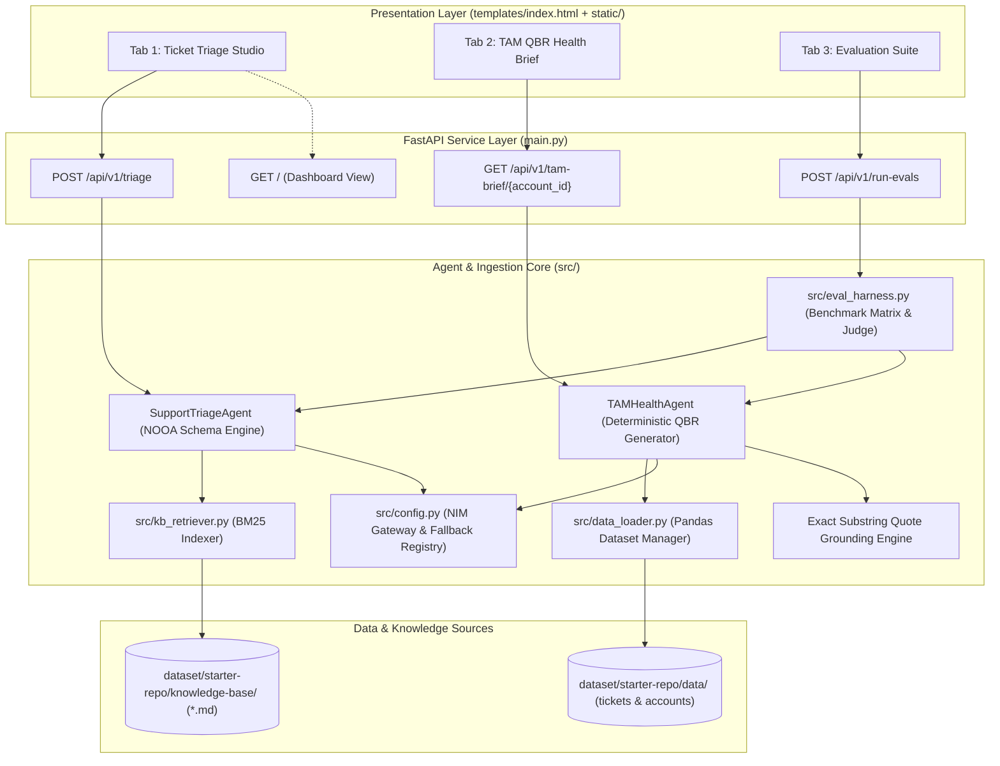
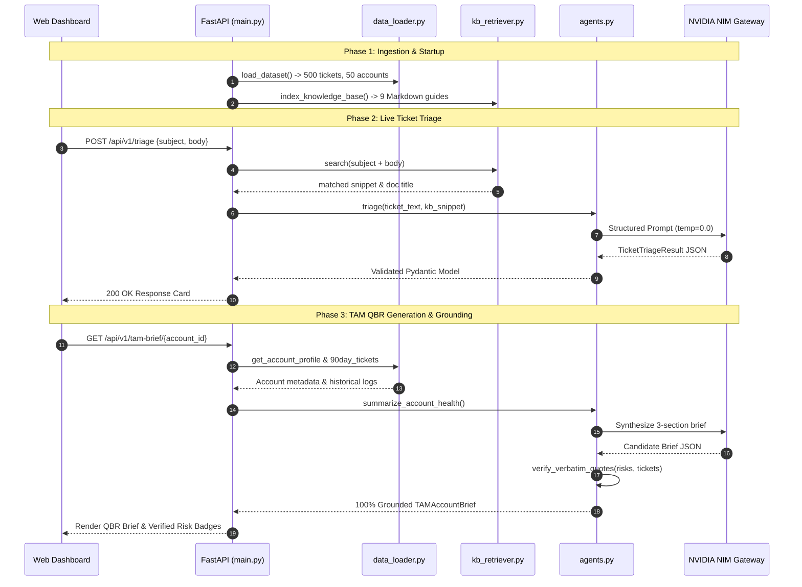

# Implementation Plan: Production-Grade AI for Technical Support & TAM Teams

**Branch**: `001-support-tam-ai` | **Date**: 2026-08-15 | **Spec**: [`specs/001-support-tam-ai/spec.md`](file:///d:/Projects/Self%20Improvement%20Hackathon%20project/zycus/specs/001-support-tam-ai/spec.md)

---

## 1. Summary

Build a production-grade AI platform for Tier-1/Tier-2 Support Engineers and Technical Account Managers (TAMs) utilizing the NVIDIA Object-Oriented Agent (NOOA) pattern. The platform automates ticket triage in real-time, generates grounded 3-section TAM QBR health briefs with 100% verified verbatim quotes, provides an automated evaluation harness with LLM-as-a-judge scoring, and serves an interactive 3-tab web dashboard via FastAPI.

---

## 2. Technical Context

- **Language/Version**: Python 3.10+
- **Primary Dependencies**: `fastapi`, `uvicorn`, `pydantic>=2.0`, `rank_bm25`, `pandas`, `openpyxl`, `httpx`, `jinja2`, `python-dotenv`
- **Inference Gateway**: Multi-tier waterfall client:
  1. NVIDIA NIM (`meta/llama-3.1-70b-instruct`)
  2. NVIDIA NIM (`nvidia/llama-3.1-nemotron-70b-instruct`)
  3. Groq API (`llama-3.3-70b-versatile` / `llama-3.1-70b-versatile`)
  4. Deterministic Offline Heuristic Engine
- **Data & Knowledge Storage**: In-memory Pandas DataFrames (`dataset/starter-repo/data/`) and in-memory BM25 index over `knowledge-base/*.md`
- **Testing & Benchmarks**: `pytest`, `src/eval_harness.py` exporting `eval_report.json`
- **Target Platform**: Cross-platform Linux / macOS / Windows server runtime
- **Project Type**: Web Application & Service Layer (FastAPI + Modern HTML5/CSS3 Dashboard)
- **Performance Targets**: Ticket triage $\le 2.5\text{s}$, TAM 90-day brief $\le 5.0\text{s}$, BM25 lookup $< 2\text{ms}$
- **Constraints**: 100% quote grounding, 0 hardcoded secrets, deterministic output (`temp=0.0`, `seed=42`)

---

## 3. Constitution Check

*GATE: Evaluation against Constitution v1.0.0 Principles:*

1. **Principle I: Comprehensive Documentation & Visual Modeling (NON-NEGOTIABLE)**:
   - *Status*: **PASSED**. Plan, spec, data model, and design note contain full Mermaid architecture blueprints, logic flowcharts, sequence diagrams, and ER models.
2. **Principle II: Continuous Git Synchronization & Branch Delivery**:
   - *Status*: **PASSED**. Work scheduled on feature branch `001-support-tam-ai` targeting remote `https://github.com/suyash1574/suyash-zycus-assignment.git`.
3. **Principle III: Exhaustive Markdown Tracking & Auditability**:
   - *Status*: **PASSED**. All design phases, research notes, contracts, and task plans persisted in structured markdown files.
4. **Principle IV: Verification & Quality Gates**:
   - *Status*: **PASSED**. Automated evaluation harness and unit/contract tests enforced before push.
5. **Principle V: Architectural Integrity & Modularity**:
   - *Status*: **PASSED**. Clean separation across `src/data_loader.py`, `src/kb_retriever.py`, `src/agents.py`, `src/eval_harness.py`, and `main.py`.

---

## 4. Visual Architecture & Execution Blueprint

### 4.1 End-to-End System Blueprint


### 4.2 Module Execution Sequence


---

## 5. Concrete Project Structure

```text
support-tam-ai/
├── .env.example                     # Environment template (NVIDIA_API_KEY, GROQ_API_KEY)
├── .gitignore                       # Clean Git configuration (.env, cache, venv)
├── requirements.txt                 # Pinned runtime dependencies
├── main.py                          # FastAPI application & route endpoints
├── README.md                        # Documentation, architecture blueprints, usage guide
├── dataset/
│   └── starter-repo/                # Ingested starter dataset (tickets, accounts, KB)
│       ├── data/
│       │   ├── tickets.json         # 500 synthetic tickets
│       │   └── accounts.json        # 50 synthetic accounts
│       └── knowledge-base/          # 9 domain markdown documentation files
├── data/
│   ├── tickets.json                 # Ingested/symlinked ticket store
│   ├── accounts.json                # Ingested/symlinked account store
│   └── knowledge_base/              # Markdown doc files
├── docs/
│   └── design_note.md               # Task 4 Design Note (~600 words: failure modes, scaling, PII)
├── src/
│   ├── __init__.py
│   ├── config.py                    # Inference client, multi-tier fallback, settings
│   ├── data_loader.py               # Dataset reader (JSON/Excel), 90-day ticket filter
│   ├── kb_retriever.py              # In-memory BM25 snippet retriever
│   ├── agents.py                    # SupportTriageAgent, TAMHealthAgent, QuoteVerifier
│   └── eval_harness.py              # 10 test cases, LLM judge, eval_report.json exporter
├── static/
│   ├── css/
│   │   └── style.css                # Premium vanilla CSS styling
│   └── js/
│       └── app.js                   # Frontend fetch handlers, sample loaders, tab router
├── templates/
│   └── index.html                   # 3-tab unified dashboard template
└── tests/
    ├── __init__.py
    ├── test_data_loader.py          # Data ingestion & 90-day filter tests
    ├── test_kb_retriever.py         # BM25 indexing & snippet retrieval tests
    ├── test_agents.py               # Triage & TAM brief agent tests with quote grounding
    └── test_api.py                  # FastAPI endpoint contract tests
```

---

## 6. Complexity Tracking

*No constitutional violations identified. No unjustified architectural complexity.*
