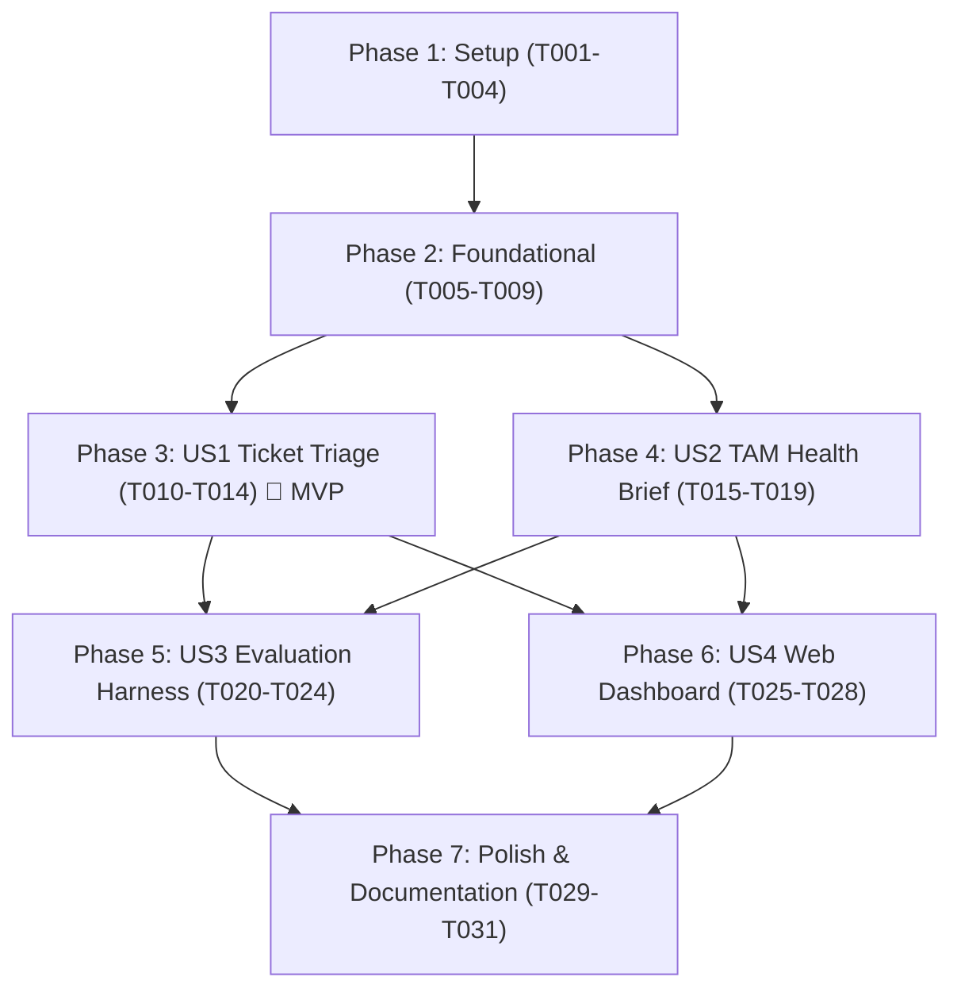

# Tasks: Production-Grade AI for Technical Support & TAM Teams

**Input**: Design documents from [`specs/001-support-tam-ai/`](file:///d:/Projects/Self%20Improvement%20Hackathon%20project/zycus/specs/001-support-tam-ai)  
**Prerequisites**: [plan.md](file:///d:/Projects/Self%20Improvement%20Hackathon%20project/zycus/specs/001-support-tam-ai/plan.md), [spec.md](file:///d:/Projects/Self%20Improvement%20Hackathon%20project/zycus/specs/001-support-tam-ai/spec.md), [research.md](file:///d:/Projects/Self%20Improvement%20Hackathon%20project/zycus/specs/001-support-tam-ai/research.md), [data-model.md](file:///d:/Projects/Self%20Improvement%20Hackathon%20project/zycus/specs/001-support-tam-ai/data-model.md), [contracts/](file:///d:/Projects/Self%20Improvement%20Hackathon%20project/zycus/specs/001-support-tam-ai/contracts)  

---

## Phase 1: Setup (Shared Infrastructure)

**Purpose**: Project initialization, dependency management, and dataset alignment.

- [X] T001 Initialize project directory structure (`src/`, `data/`, `docs/`, `static/`, `templates/`, `tests/`)
- [X] T002 [P] Create `requirements.txt` with `fastapi`, `uvicorn`, `pydantic>=2.0`, `rank_bm25`, `pandas`, `openpyxl`, `httpx`, `jinja2`, `python-dotenv`, `pytest`
- [X] T003 [P] Create `.env.example` and verify `.gitignore` ignores `.env`, `__pycache__`, and virtual environments
- [X] T004 Copy and link starter data and knowledge base documents from `dataset/starter-repo/` to `data/` and `data/knowledge_base/`

---

## Phase 2: Foundational (Blocking Prerequisites)

**Purpose**: Core data ingestion, in-memory BM25 retrieval, and multi-tier LLM inference gateway that all agents depend upon.

- [X] T005 Implement environment configuration and multi-tier inference gateway in `src/config.py` (NVIDIA NIM $\rightarrow$ Groq $\rightarrow$ Offline Heuristics)
- [X] T006 [P] Implement dataset loader and 90-day ticket history filter in `src/data_loader.py`
- [X] T007 [P] Implement in-memory BM25 tokenized snippet indexer in `src/kb_retriever.py` with anti-hallucination thresholding
- [X] T008 [P] Implement base Pydantic schemas in `src/schemas.py` matching `specs/001-support-tam-ai/data-model.md`
- [X] T009 Write unit tests for data loader and BM25 retriever in `tests/test_data_loader.py` and `tests/test_kb_retriever.py`

**Checkpoint**: Core foundation validated — agent implementation can now proceed.

---

## Phase 3: User Story 1 - Intelligent Ticket Triage Agent (Priority: P1) 🎯 MVP

**Goal**: Automatically ingest raw support tickets, classify product area, issue category, and urgency (P1–P4) with reasoning, match internal Markdown KB snippets, assign responder teams, and draft empathetic customer responses.

**Independent Test**: Send ticket payloads via `POST /api/v1/triage` and verify structured `TicketTriageResult` returned in $\le 2.5\text{s}$ with correct classifications and matched KB snippets.

### Tests for User Story 1
- [X] T010 [P] [US1] Write contract and integration tests for ticket triage in `tests/test_triage_agent.py`

### Implementation for User Story 1
- [X] T011 [US1] Implement keyword tripwires and PII regex sanitization in `src/agents.py`
- [X] T012 [US1] Implement `SupportTriageAgent` with NOOA prompt formatting and Pydantic validation in `src/agents.py`
- [X] T013 [US1] Implement `POST /api/v1/triage` endpoint in `main.py`
- [X] T014 [US1] Verify and validate User Story 1 triage flow with sample tickets

**Checkpoint**: User Story 1 (MVP) is fully functional and testable independently.

---

## Phase 4: User Story 2 - TAM QBR Account Health Summariser (Priority: P1)

**Goal**: Ingest customer account ID, aggregate 90-day ticket history and account metadata, generate deterministic 3-section QBR health brief (Executive Summary, Open Risks, Talking Points), and enforce 100% exact substring quote verification.

**Independent Test**: Query `GET /api/v1/tam-brief/ACC-3847` and assert executive summary is 3–5 sentences, talking points are actionable, and all risk direct quotes exist verbatim in source tickets.

### Tests for User Story 2
- [X] T015 [P] [US2] Write tests for TAM summariser and quote verification in `tests/test_tam_agent.py`

### Implementation for User Story 2
- [X] T016 [US2] Implement exact substring quote verification engine (`verify_verbatim_quotes`) in `src/agents.py`
- [X] T017 [US2] Implement `TAMHealthAgent` synthesizing 3-section QBR brief with deterministic temperature (`0.0`) in `src/agents.py`
- [X] T018 [US2] Implement `GET /api/v1/tam-brief/{account_id}` endpoint in `main.py`
- [X] T019 [US2] Verify and validate User Story 2 against active and zero-ticket accounts

**Checkpoint**: User Stories 1 AND 2 are both fully functional and testable.

---

## Phase 5: User Story 3 - Automated Evaluation Harness (Priority: P2)

**Goal**: Provide an automated evaluation harness running 10+ standard, edge, and adversarial test cases with schema checks and LLM-as-a-judge scoring, exporting results to `eval_report.json` and Markdown tables.

**Independent Test**: Execute `POST /api/v1/run-evals` or `pytest tests/test_eval_harness.py` and verify composite score $\ge 0.80$ with generated `eval_report.json`.

### Tests & Implementation for User Story 3
- [X] T020 [P] [US3] Create benchmark test dataset (standard, edge, prompt-injection cases) in `src/eval_harness.py`
- [X] T021 [US3] Implement scoring engine and LLM-as-a-judge evaluator in `src/eval_harness.py`
- [X] T022 [US3] Implement JSON/Markdown report exporter producing `eval_report.json` in `src/eval_harness.py`
- [X] T023 [US3] Implement `POST /api/v1/run-evals` endpoint in `main.py`
- [X] T024 [US3] Write test suite validating evaluation engine in `tests/test_eval_harness.py`

**Checkpoint**: Evaluation harness executes and generates verified benchmark reports.

---

## Phase 6: User Story 4 - Unified Interactive Web Dashboard (Priority: P2)

**Goal**: Render a modern, accessible 3-tab web dashboard (Ticket Triage Studio, TAM QBR Health Brief, Evaluation Suite) with single-click sample loaders and live benchmark progress.

**Independent Test**: Load `http://localhost:8000/` in browser, test Tab 1, Tab 2, and Tab 3 sample interactions, and verify real-time data rendering.

### Implementation for User Story 4
- [X] T025 [P] [US4] Build modern responsive CSS design system in `static/css/style.css`
- [X] T026 [P] [US4] Build dashboard HTML structure and 3-tab layout in `templates/index.html`
- [X] T027 [US4] Implement frontend asynchronous fetch handlers and sample loaders in `static/js/app.js`
- [X] T028 [US4] Connect dashboard view route `GET /` in `main.py`

**Checkpoint**: All 4 user stories are fully integrated into the interactive web UI.

---

## Phase 7: Polish & Documentation (Cross-Cutting Concerns)

**Purpose**: Comprehensive technical documentation, Task 4 Design Note, and end-to-end quickstart validation.

- [X] T029 [P] Write Task 4 Design Note in `docs/design_note.md` covering failure modes, latency/quality trade-offs, PII handling, and 10× scaling
- [X] T030 [P] Write comprehensive project `README.md` with system overview, architecture diagrams, setup instructions, and API docs
- [X] T031 Execute end-to-end quickstart validation per `specs/001-support-tam-ai/quickstart.md` and verify all tests pass

---

## Dependencies & Execution Order

